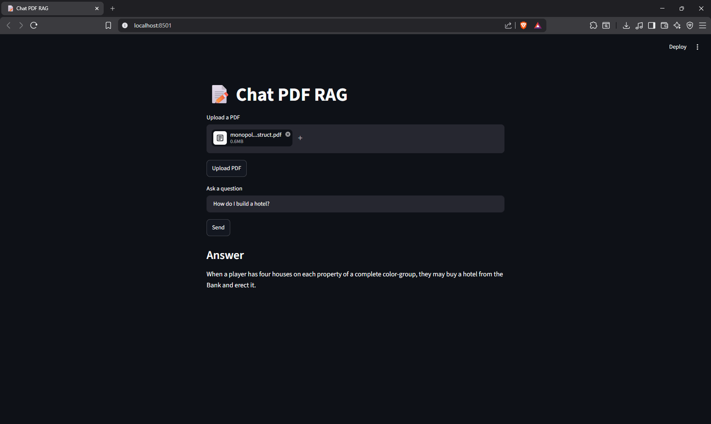

# PDF RAG Assistant

A Retrieval-Augmented Generation (RAG) system that enables users to upload PDF documents and ask natural language questions. The system retrieves relevant context using semantic search and generates grounded answers using Google Gemini.

---

## Features

* PDF document ingestion
* PDF parsing and processing
* Text chunking using LangChain
* Semantic embeddings with Hugging Face
* Vector storage using ChromaDB
* Context retrieval through similarity search
* Question answering powered by Google Gemini
* REST API built with FastAPI
* Interactive API documentation with Swagger UI
* Streamlit frontend interface
* Source-grounded responses
* Modular project architecture

---

## Tech Stack

* Python
* FastAPI
* Streamlit
* LangChain
* ChromaDB
* Hugging Face Embeddings
* Google Gemini
* PyPDF

---

## Screenshots

### PDF upload, question asked, and generated answer


### 
---

## How to Run

### Clone the repository

```text
git clone https://github.com/1affogato/chat-pdf-rag.git

cd chat-pdf-rag
```

### Create a virtual environment

```text
python -m venv venv
```

### Activate the virtual environment

#### Windows

```text
venv\Scripts\activate
```

#### Linux / macOS

```text
source venv/bin/activate
```

### Install dependencies

```text
pip install -r requirements.txt
```

---

## Environment Variables

### Create a `.env` file in the project root

```text
GOOGLE_API_KEY=your_google_api_key
```

---

## Running the Backend

### Start FastAPI

```text
uvicorn main:app --reload
```

### API Documentation

```text
http://127.0.0.1:8000/docs
```

---

## Running the Frontend

### Start Streamlit

```text
streamlit run app.py
```

### Open

```text
http://localhost:8501
```

---

## Project Structure

```text
chat-pdf-rag/

│
├── src/
│   ├── api/
│   ├── services/
│   ├── embeddings/
│   ├── prompts/
│   └── utils/
│
├── chroma/
│
├── frontend/
│
├── app.py
├── main.py
├── requirements.txt
├── .env
└── README.md
```

---

## Future Improvements

* Multi-document support
* Conversation memory
* Chat history persistence
* Source citations with page references
* Authentication and user accounts
* Docker deployment
* Cloud deployment
* PDF summarization
* Automatic study guide generation
* Support for DOCX and TXT files
* Streaming responses
* Hybrid search (semantic + keyword)

---

## Architecture

```text
PDF Upload
      │
      ▼
 Document Loader
      │
      ▼
 Text Chunking
      │
      ▼
 Hugging Face Embeddings
      │
      ▼
 ChromaDB Vector Store
      │
      ▼
 Similarity Search
      │
      ▼
 Retrieved Context
      │
      ▼
 Google Gemini
      │
      ▼
 Generated Answer
```

---

## API Endpoints

### Upload a PDF

#### POST /upload

Uploads and automatically indexes a PDF document.

---

### Ask Questions

#### POST /ask

Receives a natural language question and returns an answer based on the indexed documents.

---

### Example Request

```text
{
  "question": "What is an Artificial Neural Network?"
}
```

### Example Response

```text
{
  "answer": "An Artificial Neural Network is a mathematical model that receives external inputs or inputs from other neurons, combines them, and produces an output to perform specific tasks."
}
```